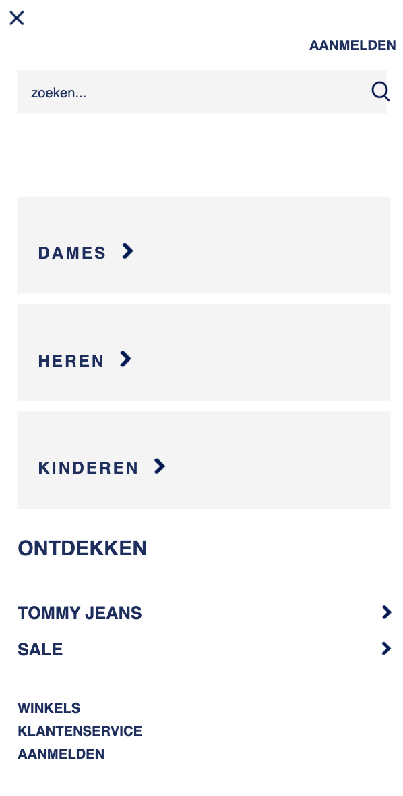
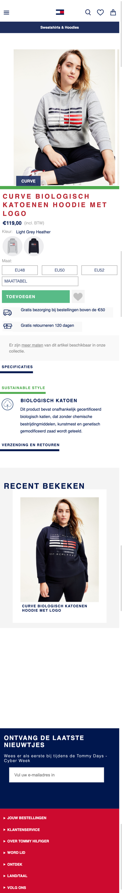
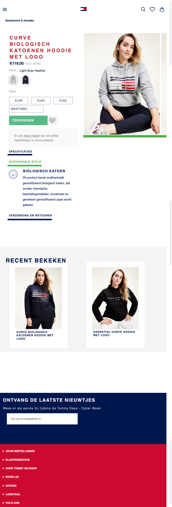
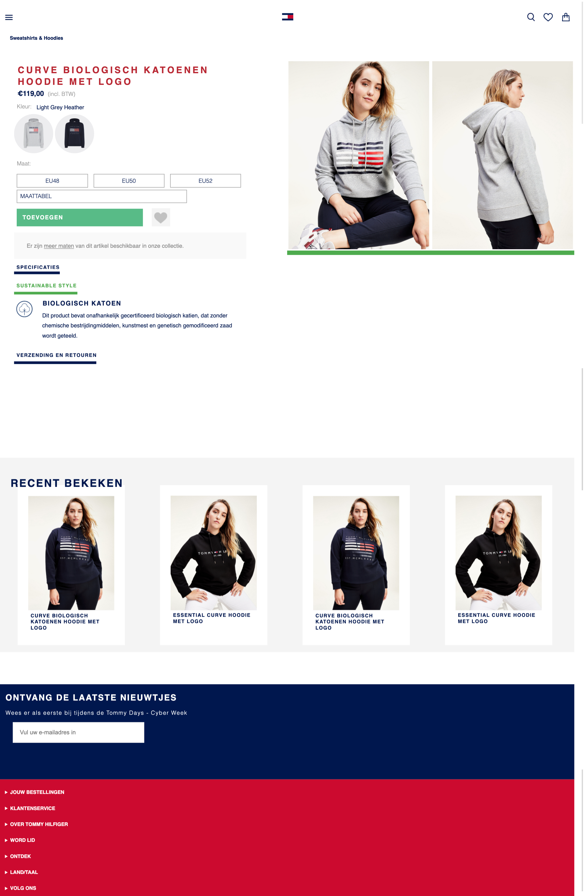
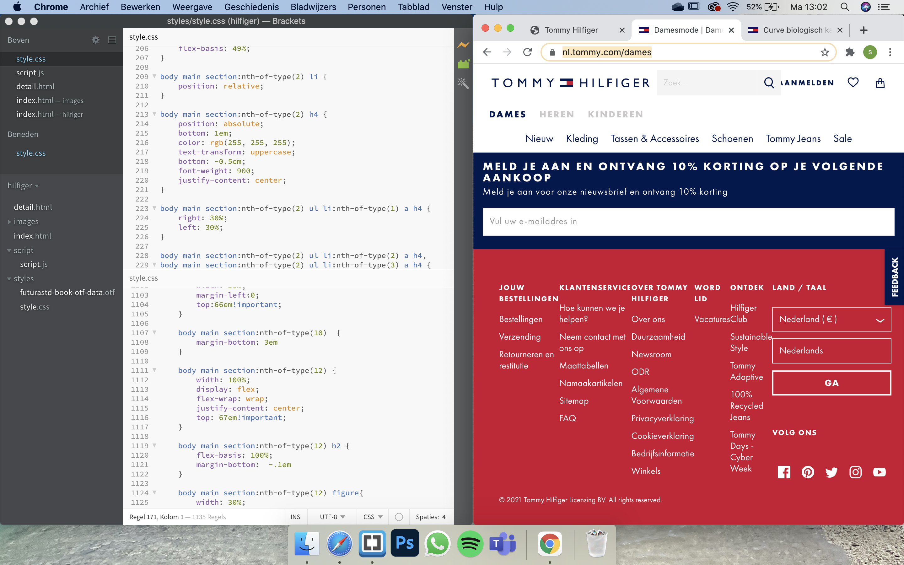
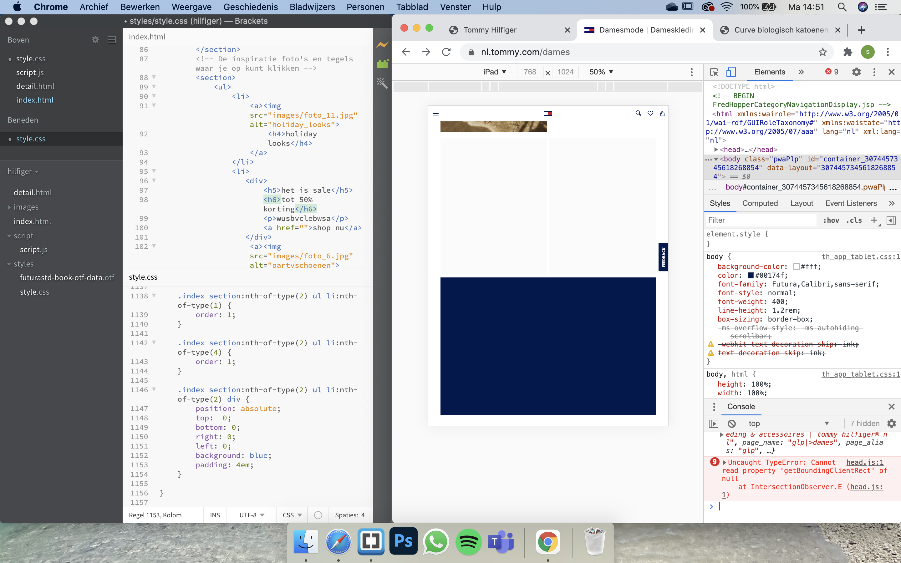
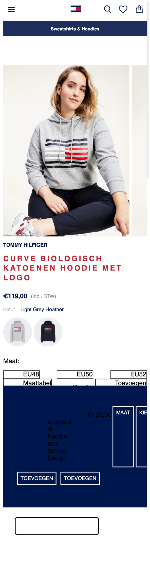
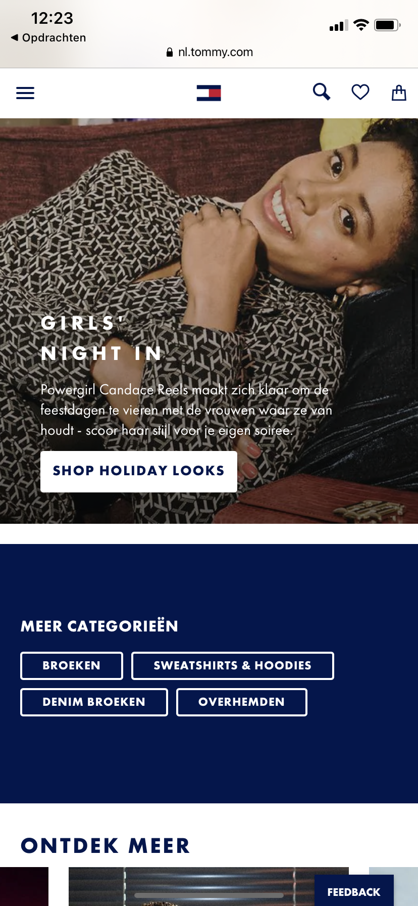

# Procesverslag
**Auteur:** Susan van de Wiel

## Bronnenlijst
1. https://www.youtube.com/watch?v=YszONjKpgg4
2. https://codepen.io/shooft/pen/BaKGKwm
3. https://codepen.io/shooft/pen/vYGQNZj
4. Martijn van der Lans > 201
5. Iris van Ollefen > studentassistent

## Het eindresultaat
**De indexpagina:**
Mobiel:

iPad:

Desktop:

Hamburgermenu:

**De detailpagina:**
Mobiel:

iPad:

Desktop:

## Eindgesprek (week 7/8)

Met de andere vakken, die ook veel tijd vroegen, vond ik het lastig om die vakken met frondend te combineren. Het coderen vergt bij mij meer tijd, omdat ik de verbanden tussen bepaalde codes niet kan leggen. In de kerstvakantie heb ik dus bijna al mijn tijd besteed aan die vakken (wat eigenlijk niet heel slim is geweest). Nu wist ik dat ik wel voor een herkansing moest gaan aangezien beide pagina's nog responsive gemaakt moesten worden.

Toch ben ik naar het beoordelingsgesprek gegaan om nog wat feedback te krijgen van Janno. De feedback was dat ik mijn code goed en netjes had geschreven, de comments in de HTML en CSS nog iets beter konden en dat dit op een andere manier beschreven moest worden, namelijk: hier heb ik gebruik gemaakt van een nav met daarin een ul-structuur li / a / img etc. Dit had ik nog nooit eerder zo gedaan dus dit was nieuw voor mij. Er stond ook in mijn code ergens een span, wat beter een div kon worden. En ik moet natuurlijk de pagina's nog responsive maken.

Na het gesprek met Janno heb ik een beginnetje gemaakt met het responsive maken van de index pagina. Ik bekeek hoe de site van Tommy Hilfiger eruit ziet wanneer je hem op iPad/desktop bekeek. Ik zag dat de footer er ontzettend rommelig uitzag, namelijk zo:

Ik heb er daarom voor gekozen om de footer als een dropdown te houden. Ook zag ik dat de content van de index pagina soms niet meeschaalde, zie hieronder:

Hij liet de foto's dan niet meer zien van de pagina, dus dat was ook erg vreemd. Daarom heb ik van de iPad pagina mijn eigen ingeven gemaakt wat toch binnen de stijl van Tommy Hilfiger blijft.

Ik besloot Martijn een appje te doen met de vraag of hij mij kon helpen bij het responsive maken van de website. Ik had namelijk een opstapje nodig bij het coderen om de site responsive te krijgen. Samen hebben we gekeken naar de index- en detailpagina. Hij zei dat het eigenlijk niet handig is geweest dat mijn hele website bestaat uit position:absolute en position:relative, omdat niets dan op de goede manier meeschaalt. Het was te kortdag om de code opnieuw te schrijven en dit dan wel op de goede manier te doen, dus meer gebruik maken van:
- display:flex
- justify-content:center
-

Met zijn hulp lukte het toch om de pagina's goed responsive te maken, maar een paar kleine dingetjes konden we samen niet oplossen.

Thuis ben ik verder gaan werken om alles, wanneer de pagina's responsive waren, op de goede plek te zetten. Ook ben ik bezig geweest met de micro-interactie, namelijk het hamburgermenu, werkt te maken. Ik moest de theorie weer even ergens opduiken, maar het lukte uiteindelijk wel en dat maakte me erg blij!

## Voortgang 3 (week 6)

Tijdens deze voortgang had eigenlijk niemand in mijn groepje vragen voor Iris. Ik had alleen de vraag gesteld of je alleen elementen kunt positioneren via postion:relative en postion:absolute want zo had ik mijn hele website (index en detail) opgebouwd. Ze gaf aan dat dit mogelijk was en dat er nog verschillende "positions" bestaan zoals bijvoorbeeld postion:fixed.

Zodra ik de pagina responsive maakte, zag ik dat alle elementen uitelkaar gingen en bijna niets op zijn plek bleef staan. Ik dacht dat dit hoorde, maar het stukje dat ik met Martijn had gemaakt schaalde als enige wel mee. Aangezien ik dacht dat dit hoorde, maakte ik mij nog niet zo druk.

## Voortgang 2 (week 5)

**Susan:**
- Hoe los ik de witruimte op (nergens zit een grote width, height, margin of padding op)
- Hoe stijl ik de footer? Op internet staan alleen maar moeilijke dingen
- Hoe maak ik de functieloze groene balk onder de foto (en hoe gaat deze responsive mee?)
- Hoeveel classes mag je meegeven? Ik heb er nu 1 op de main van de detailpagina, mag dat wel?

**Suzanne:**
- Weten hoe ik mijn carousel moet maken?
- Hoe ik bij 'waarom sonos' de afbeeldingen over elkaar moet plaatsen en positioneren?
- Hoe ik bij 'waarom sonons' die underline kleiner maak?
- Hoeveel 'kopjes' ik bij de nieuws pagina moet maken?
- Hoe krijg ik bij kerst mijn achtergrond img?

**Sarah:**
- Hoe gebruik ik de ::before goed voor de strepen
- Hoe maak ik me tabbar sticky
- Hoe fix ik me tabbar goed
- Hoe maak ik de dropdown zoals op de website

**Palenque:**
- Hoe zorg ik er voor dat me menubar sticky wordt.
- Hoe zorg ik er voor dat je niet kan scrollen als me menu open staat.
- Hoe maak ik me button bewegend?
- Moet ik die flash img aanpassen?

### Verslag van meeting
Tijdens de meeting kregen we antwoord op onze vragen en gingen we kijken naar onze voortgangen van de website. De antwoorden op mijn vragen waren:
- Dit wist Iris niet waardoor dat kon komen.
- Dit hoef je niet te stijlen want je kiest ervoor om responsive te maken en dat hoeft dus niet te 'werken'
- Je kunt het een border-bottom meegeven of een div aanmaken en die stijlen
- Je mag best wat meer classes meegeven, zolang je maar wel via het pseudopad blijft aanroepen.

## Huiswerk week 4
Ik ben bezig geweest met het coderen van de detail pagina. Ik ben nu hier:

Ik merk dat ik het nog steeds lastig vind met display:flex, flex-wrap:wrap en flex-basis:100% (bijvoorbeeld). Vooral omdat deze pagina veel buttons bevat die naast elkaar moeten komen te staan.

## Voortgang 1 (week 3)

### Stand van zaken

Ik vond het nog erg lastig om soms display:flex te gebruiken, met bijvoorbeeld flex-wrap:wrap of flex-basis:100%. Ik heb het meeste moeite gehad met de header, daar zit de meeste tijd in omdat ik het lastig vond om alles goed te positioneren. Na hulp van Martijn is het mij toch gelukt.

Ik ben nu nog bezig met de main page. Door een drukke week met veel ander huiswerk vond ik het lastig te combineren (ook omdat ik coderen lastig vind, komt er gauw veel tijd bij kijken :-)). Ik vind dat ik tot nu toe al erg ver ben gekomen voor mijn doen.

### Agenda voor meeting

**Susan:**
- Hoe voeg je een eigen lettertype toe? Ik heb namelijk een lettertype dat eindigt op .otf
- Hoe kun je het beste witruimte oplossen? Is dat alleen te doen met position:absolute?
- Hoe maak je een uitklap footer?
- Moet je in Gitgub ook de opdrachten van codepen.io toevoegen?

**Suzanne:**
- Hoe maak je een talenselectie onderin de footer?
- Hoe moet ik de kerstbanner uitwerken?

**Sarah:**
- Hoe zet ik een hartje op m'n foto's en hoe bewerk ik dit goed met JavaScript?
- Ik twijfel of me site wel goed responsive is, heb ik wel de juiste code gebruikt hiervoor?
- Hoe ga ik de tab bar verwerken in me website?
- Hoe stijl ik de dropdown list met de foto’s etc er in op me detailpagina?

**Palenque:**
- Moet ik de carousel/slider/button maken met gewoon css?
- Moet ik de foto’s van insta “life” er in zetten?
- Moeten de links binnen je eigen website terug linken naar de andere pagina?

### Verslag van meeting

Tijdens de meeting kregen we antwoord op onze vragen en gingen we kijken naar onze voortgangen van de website. De antwoorden op mijn vragen waren:
- Probeer @font-face { font-family: "Futura Std"; src: url("/styles/futurastd-book-otf-data.otf") format("otf"), } toe te voegen in de CSS
- Ja, dat kan met postion:absolute.
- Iris wist hier geen antwoord op, dus ik heb Martijn hiervoor gevraagd en hij gaf aan dat je hiervoor "detail" en "summary" voor kon gebruiken.
- Nee dat is niet nodig.

Met deze antwoorden ben ik verder gaan werken aan de website.

## Breakdownschets na feedback (week 1)

**Werkgroep 2, week 1:** In werkgroep 1 kreeg ik feedback op mijn breakdownschets. Zo kreeg ik feedback om: meer iconen te gebruiken in plaats van img. Ik was vergeten om de header, main en footer aan te geven en er werd ook verteld dat het handig was om figure en figcaption te gebruiken. Dit heb ik aangepast in mijn breakdownschets, zodat dit mij makkelijker kan helpen tijdens het coderen.

## Breakdownschets (week 1)

**Werkgroep 1, week 1:** In week 1 ben ik begonnen met een breakdownschets te maken van de main page van de site van Tommy Hilfiger. Hierin gaf ik aan welke elementen de main pagina bevat. Dit maakt het later makkelijker om te coderen, een soort geheugensteuntje.

## Intake (week 1)
**Je startniveau:** Ik zit op starttniveau blauw. Het coderen vind ik lastig en is niet mijn sterkste punt. Ik heb het inzicht niet om verschillende codes te gebruiken en om dit snel te leren zonder hulp. Mer hulp van anderen lukt het mij meestal wel, maar ik vind het vervelend om klasgenoten telkens te moeten vragen dus probeer ik het meestal zelf op te lossen.

**Je focus:** Mijn focus is het responsive maken van de Tommy Hilfiger site.

**Je opdracht:** Mijn opdracht is de site van Tommy Hilfiger en dan specifiek het dameskleding gedeelte.

**Main:** De link naar de main pagina van Tommy Hilfiger is: https://nl.tommy.com/dames

**Detail:** De link naar de detail pagina van Tommy Hilfiger is: https://nl.tommy.com/curve-biologisch-katoenen-hoodie-met-logo-ww0ww29732pkh

**Screenshot(s) van de eerste pagina (small screen):**

**Screenshot(s) van de tweede pagina (small screen):**

