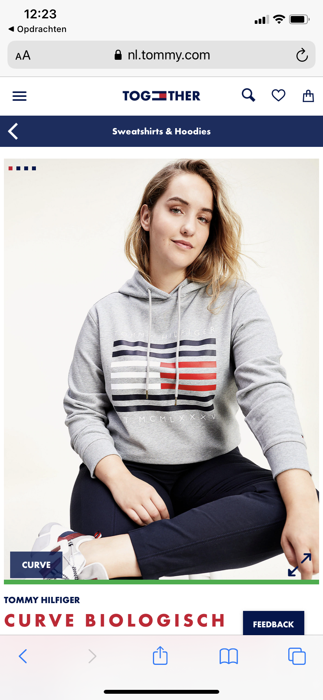
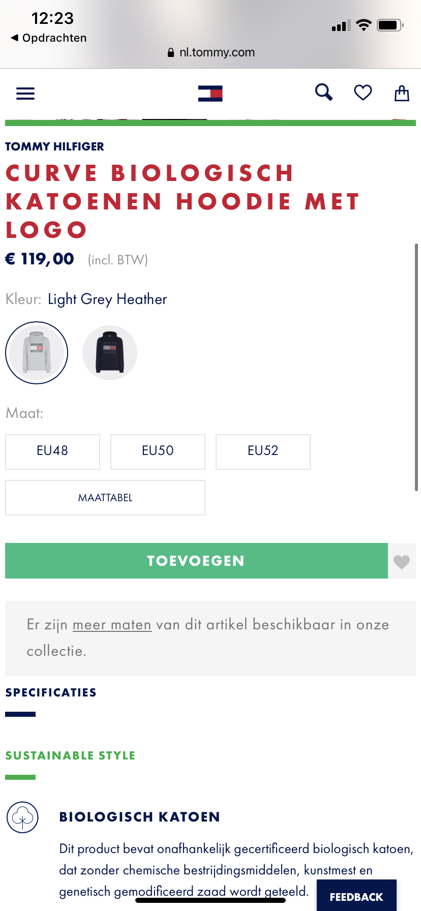
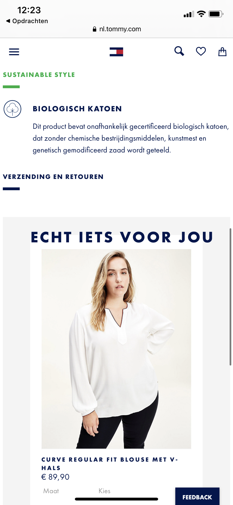

# Procesverslag
**Auteur:** Susan van de Wiel

Markdown cheat cheet: [Hulp bij het schrijven van Markdown](https://github.com/adam-p/markdown-here/wiki/Markdown-Cheatsheet). Nb. de standaardstructuur en de spartaanse opmaak zijn helemaal prima. Het gaat om de inhoud van je procesverslag. Besteedt de tijd voor pracht en praal aan je website.

## Bronnenlijst
1. -bron 1-
2. -bron 2-
3. -...-

## Eindgesprek (week 7/8)

-dit ging goed & dit was lastig-

**Screenshot(s):**

-screenshot(s) van je eindresultaat-

## Voortgang 3 (week 6)

-same as voortgang 1-

## Voortgang 2 (week 5)

-same as voortgang 1-

## Voortgang 1 (week 3)

### Stand van zaken

-dit ging goed & dit was lastig-

**Screenshot(s):**

-screenshot(s) van hoe ver je bent met korte uitleg-

### Agenda voor meeting

-samen met je groepje opstellen-

| student 1      | student 2          | student 3    | student 4        |
| ---            | ---                | ---          | ---              |
| dit bespreken  | en dit             | en ik dit    | en dan ik dat    |
| an dat ook nog | dit als er tijd is | nog een punt | dit wil ik zeker |
| ...            | ...                | ...          | ...              |

### Verslag van meeting

-na afloop snel uitkomsten vastleggen-

## Breakdownschets (week 1)

Dit is mijn gemaakte breakdownschets van de main pagina, dus de pagina waar je als eerste opkomt wanneer je op 'dames' hebt geklikt. Dit is de hoofdpagina van de dames kleding van Tommy Hilfiger.

## Intake (week 1)
**Je startniveau:** Mijn startniveau is rood

**Je focus:** Ik wil mij graag meer focussen op surface plane

**Je opdracht:** Mijn opdracht is de site van Tommy Hilfiger

**Main:** Als main pagina kies ik de hoofdpagina van de dames kleding: https://nl.tommy.com/dames

**Detail:** Als detail pagina kies is de detailpagina van een hoodie voor dames: https://nl.tommy.com/curve-biologisch-katoenen-hoodie-met-logo-ww0ww29732pkh

**Screenshot(s) van de eerste pagina (small screen):**

**Screenshot(s) van de tweede pagina (small screen):**

