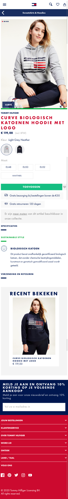

# Procesverslag
**Auteur:** Susan van de Wiel

Markdown cheat cheet: [Hulp bij het schrijven van Markdown](https://github.com/adam-p/markdown-here/wiki/Markdown-Cheatsheet). Nb. de standaardstructuur en de spartaanse opmaak zijn helemaal prima. Het gaat om de inhoud van je procesverslag. Besteedt de tijd voor pracht en praal aan je website.

## Bronnenlijst
1. -bron 1-
2. -bron 2-
3. -...-

## Eindgesprek (week 7/8)

-dit ging goed & dit was lastig-

**Screenshot(s):**

-screenshot(s) van je eindresultaat-

## Voortgang 3 (week 6)

-same as voortgang 1-

## Voortgang 2 (week 5)
Susan
- Hoe los ik de witruimte op (nergens zit een grote width, height, margin of padding op)
- Hoe stijl ik de footer? Op internet staan alleen maar moeilijke dingen
- Hoe maak ik de functieloze groene balk onder de foto (en hoe gaat deze responsive mee?)
- Hoeveel classes mag je meegeven? Ik heb er nu 1 op de main van de detailpagina, mag dat wel?

Suzanne
- Weten hoe ik mijn carousel moet maken?
- Hoe ik bij 'waarom sonos' de afbeeldingen over elkaar moet plaatsen en positioneren?
- Hoe ik bij 'waarom sonons' die underline kleiner maak?
- Hoeveel 'kopjes' ik bij de nieuws pagina moet maken?
- Hoe krijg ik bij kerst mijn achtergrond img?
    
Sarah
- Hoe gebruik ik de ::before goed voor de strepen
- Hoe maak ik me tabbar sticky
- Hoe fix ik me tabbar goed 
- Hoe maak ik de dropdown zoals op de website

Palenque
- Hoe zorg ik er voor dat me menubar sticky wordt. 
- Hoe zorg ik er voor dat je niet kan scrollen als me menu open staat.
- Hoe maak ik me button bewegend?
- Moet ik die flash img aanpassen?

### Verslag van meeting

-na afloop snel uitkomsten vastleggen-

## Huiswerk week 4
Ik ben bezig geweest met het coderen van de detail pagina. Ik ben nu hier:

## Voortgang 1 (week 3)

### Stand van zaken

Ik vond het nog erg lastig om soms display:flex te gebruiken, met bijvoorbeeld flex-wrap:wrap of flex-basis:100%. Ik heb het meeste moeite gehad met de header, daar zit de meeste tijd in omdat ik het lastig vond om alles goed te positioneren. Na hulp van Martijn is het mij toch gelukt.

Ik ben nu nog bezig met de main page. Door een drukke week met veel ander huiswerk vond ik het lastig te combineren (ook omdat ik coderen lastig vind, komt er gauw veel tijd bij kijken :-)). Ik vind dat ik tot nu toe al erg ver ben gekomen voor mijn doen.

### Agenda voor meeting
Susan
- Hoe voeg je een eigen lettertype toe? (Ik heb een lettertype dat eindigt op .otf)
- Hoe kun je het beste witruimte oplossen? Is dat alleen te doen met postion:absolute?
- Hoe maak je een uitklapfooter?
- Moet in Github ook de opdrachten komen te staan wat je hebt gemaakt in codepen.io?

Suzanne
- Hoe talenselectie  onderin de footer?
- Hoe kerstbanner uitwerken?

Sarah
- Hoe zet ik een hartje op me foto’s en hoe bewerk ik dit goed met Javascript 
- Ik twijfel of me site wel goed responsive is, heb ik wel de juiste code gebruikt hiervoor 
- Hoe ga ik de tab bar verwerken in me website?
- Hoe stijl ik de dropdown list met de foto’s etc er in op me detailpagina

Palenque
- Moet ik de carousel/slider/button maken met gewoon css?
- Moet ik de foto’s van insta “life” er in zetten? 
- Moeten de links binnen je eigen website terug linken naar de andere pagina?

### Verslag van meeting

-na afloop snel uitkomsten vastleggen-

## Breakdownschets na feedback (week 1)

**Werkgroep 2, week 1:** In werkgroep 1 kreeg ik feedback op mijn breakdownschets. Zo kreeg ik feedback om: meer iconen <icon> te gebruiken ipv , ik was vergeten om de header, main en footer aan te geven, ook werd verteld dat het handig was om <figure> en <figcaption> te gebruiken. Dit heb ik aangepast in mijn breakdownschets, zodat dit mij makkelijker kan helpen tijdens het coderen.

## Breakdownschets (week 1)

**Werkgroep 1, week 1:** In week 1 ben ik begonnen met een breakdownschets maken van de main page van de site van Tommy Hilfiger. Hierin gaf ik aan welke elementen de main page bevat. Dit maakt het later makkelijker om te coderen, een soort geheugensteuntje.

-uitwerken voor de 1e werkgroep - eind van de eerste week-

## Intake (week 1)
-uitwerken voor de kick-off werkgroep - begin van de eerste week-

**Je startniveau:** Ik zit op starttniveau rood

**Je focus:** Mijn focus is responsive

**Je opdracht:** Mijn opdracht is de site van Tommy Hilfiger

**Main:** https://nl.tommy.com/dames

**Detail:** https://nl.tommy.com/curve-biologisch-katoenen-hoodie-met-logo-ww0ww29732pkh

**Screenshot(s) van de eerste pagina (small screen):**

**Screenshot(s) van de tweede pagina (small screen):**

