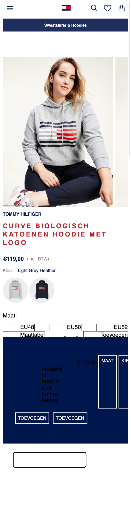
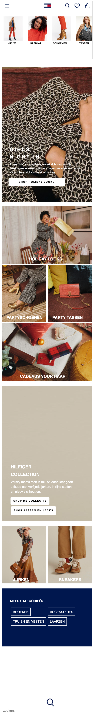
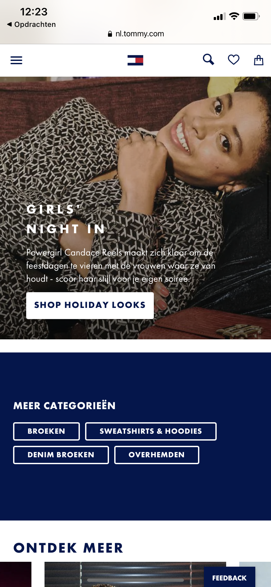
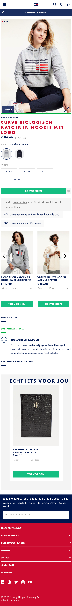

# Procesverslag
**Auteur:** Susan van de Wiel

Markdown cheat cheet: [Hulp bij het schrijven van Markdown](https://github.com/adam-p/markdown-here/wiki/Markdown-Cheatsheet). Nb. de standaardstructuur en de spartaanse opmaak zijn helemaal prima. Het gaat om de inhoud van je procesverslag. Besteedt de tijd voor pracht en praal aan je website.

## Bronnenlijst
1. -bron 1-
2. -bron 2-
3. -...-

## Eindgesprek (week 7/8)

-dit ging goed & dit was lastig-

**Screenshot(s):**

-screenshot(s) van je eindresultaat-

## Voortgang 3 (week 6)

-same as voortgang 1-

## Voortgang 2 (week 5)

-same as voortgang 1-

## Huiswerk week 4
Ik ben bezig geweest met het coderen van de detail pagina. Ik ben nu hier:

## Voortgang 1 (week 3)

### Stand van zaken

Ik vond het nog erg lastig om soms display:flex te gebruiken, met bijvoorbeeld flex-wrap:wrap of flex-basis:100%. Ik heb het meeste moeite gehad met de header, daar zit de meeste tijd in omdat ik het lastig vond om alles goed te positioneren. Na hulp van Martijn is het mij toch gelukt.

Ik ben nu nog bezig met de main page. Door een drukke week met veel ander huiswerk vond ik het lastig te combineren (ook omdat ik coderen lastig vind, komt er gauw veel tijd bij kijken :-)). Ik vind dat ik tot nu toe al erg ver ben gekomen voor mijn doen.

### Agenda voor meeting

-samen met je groepje opstellen-

| student 1      | student 2          | student 3    | student 4        |
| ---            | ---                | ---          | ---              |
| dit bespreken  | en dit             | en ik dit    | en dan ik dat    |
| an dat ook nog | dit als er tijd is | nog een punt | dit wil ik zeker |
| ...            | ...                | ...          | ...              |

### Verslag van meeting

-na afloop snel uitkomsten vastleggen-

## Breakdownschets na feedback (week 1)

**Werkgroep 2, week 1:** In werkgroep 1 kreeg ik feedback op mijn breakdownschets. Zo kreeg ik feedback om: meer iconen <icon> te gebruiken ipv , ik was vergeten om de header, main en footer aan te geven, ook werd verteld dat het handig was om <figure> en <figcaption> te gebruiken. Dit heb ik aangepast in mijn breakdownschets, zodat dit mij makkelijker kan helpen tijdens het coderen.

## Breakdownschets (week 1)

**Werkgroep 1, week 1:** In week 1 ben ik begonnen met een breakdownschets maken van de main page van de site van Tommy Hilfiger. Hierin gaf ik aan welke elementen de main page bevat. Dit maakt het later makkelijker om te coderen, een soort geheugensteuntje.

-uitwerken voor de 1e werkgroep - eind van de eerste week-

## Intake (week 1)
-uitwerken voor de kick-off werkgroep - begin van de eerste week-

**Je startniveau:** Ik zit op starttniveau rood

**Je focus:** Mijn focus is responsive

**Je opdracht:** Mijn opdracht is de site van Tommy Hilfiger

**Main:** https://nl.tommy.com/dames

**Detail:** https://nl.tommy.com/curve-biologisch-katoenen-hoodie-met-logo-ww0ww29732pkh

**Screenshot(s) van de eerste pagina (small screen):**

**Screenshot(s) van de tweede pagina (small screen):**

